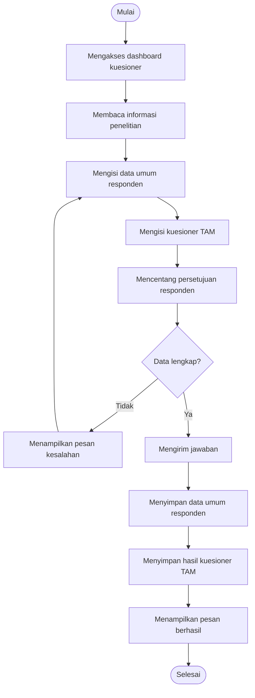
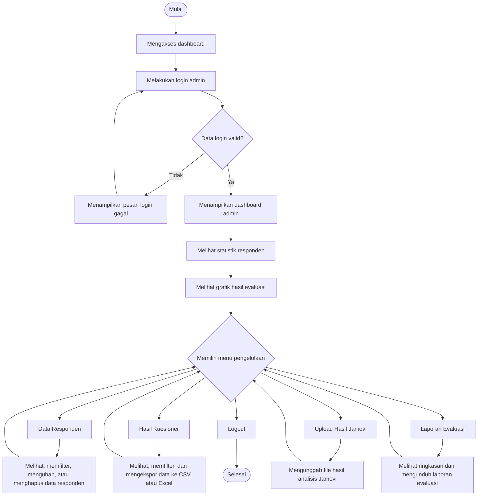

# Activity Diagram

## Activity Diagram ASN

Activity diagram ASN menggambarkan alur responden dalam menggunakan dashboard kuesioner. Proses dimulai ketika ASN mengakses dashboard, membaca informasi penelitian, mengisi data umum tanpa mencantumkan identitas pribadi, mengisi kuesioner TAM, memberikan persetujuan, dan mengirim jawaban. Sistem memvalidasi kelengkapan data. Jika data belum lengkap, sistem menampilkan pesan kesalahan. Jika data lengkap, sistem menyimpan data umum responden dan hasil kuesioner ke database MySQL.

## Activity Diagram Admin

Activity diagram Admin menggambarkan alur admin dalam mengelola data hasil evaluasi. Admin melakukan login terlebih dahulu. Jika login valid, sistem menampilkan dashboard admin. Admin dapat melihat statistik dan grafik, mengelola data responden, melihat hasil kuesioner, mengekspor data, mengunggah hasil analisis Jamovi, mengunduh laporan evaluasi, dan keluar dari sistem melalui fitur logout.
