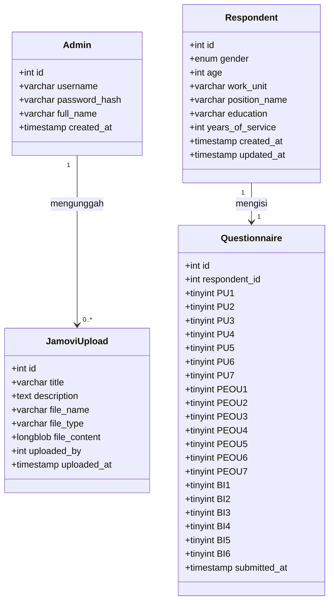

# 4.3 Perancangan Database

Perancangan database digunakan untuk menyimpan data admin, data umum responden, hasil kuesioner Technology Acceptance Model (TAM), serta file hasil analisis Jamovi. Data responden pada sistem ini bersifat anonim dan tidak menyimpan nama, NIP, email, atau identitas pribadi lainnya.

## 4.3.1 Class Diagram

## 4.3.2 Kamus Data

| Entitas | Keterangan |
|---|---|
| `admins` | Menyimpan akun administrator yang digunakan untuk login ke dashboard admin. |
| `respondents` | Menyimpan data umum responden secara anonim. |
| `questionnaires` | Menyimpan jawaban kuesioner TAM dari responden. |
| `jamovi_uploads` | Menyimpan file hasil analisis Jamovi yang diunggah oleh admin sebagai arsip. |

| Field | Keterangan |
|---|---|
| `id` | Primary key atau kode unik pada tabel. |
| `username` | Username admin untuk proses login. |
| `password_hash` | Password admin yang telah di-hash. |
| `full_name` | Nama lengkap admin. |
| `gender` | Jenis kelamin responden. |
| `age` | Usia responden. |
| `work_unit` | Unit kerja responden. |
| `position_name` | Jabatan responden. |
| `education` | Pendidikan terakhir responden. |
| `years_of_service` | Masa kerja responden dalam tahun. |
| `respondent_id` | Foreign key yang menghubungkan tabel `questionnaires` dengan `respondents`. |
| `PU1` sampai `PU7` | Jawaban kuesioner variabel Perceived Usefulness. |
| `PEOU1` sampai `PEOU7` | Jawaban kuesioner variabel Perceived Ease of Use. |
| `BI1` sampai `BI6` | Jawaban kuesioner variabel Behavioral Intention. |
| `submitted_at` | Waktu pengiriman kuesioner. |
| `title` | Judul file hasil analisis Jamovi. |
| `description` | Catatan file hasil analisis Jamovi. |
| `file_name` | Nama file yang diunggah. |
| `file_type` | Tipe file yang diunggah. |
| `file_content` | Isi file yang disimpan dalam database. |
| `uploaded_by` | Foreign key yang menghubungkan file upload dengan admin. |
| `uploaded_at` | Waktu file diunggah. |

## 4.3.3 Struktur Tabel Database

### Tabel `admins`

| Nama Field | Tipe Data | Keterangan |
|---|---|---|
| `id` | INT AUTO_INCREMENT | Primary key |
| `username` | VARCHAR(50) | Username admin dan bersifat unik |
| `password_hash` | VARCHAR(255) | Password admin dalam bentuk hash |
| `full_name` | VARCHAR(100) | Nama lengkap admin |
| `created_at` | TIMESTAMP | Waktu akun dibuat |

### Tabel `respondents`

| Nama Field | Tipe Data | Keterangan |
|---|---|---|
| `id` | INT AUTO_INCREMENT | Primary key |
| `gender` | ENUM('Laki-laki', 'Perempuan') | Jenis kelamin responden |
| `age` | INT | Usia responden |
| `work_unit` | VARCHAR(150) | Unit kerja responden |
| `position_name` | VARCHAR(120) | Jabatan responden |
| `education` | VARCHAR(50) | Pendidikan terakhir responden |
| `years_of_service` | INT | Masa kerja responden dalam tahun |
| `created_at` | TIMESTAMP | Waktu data dibuat |
| `updated_at` | TIMESTAMP | Waktu data diperbarui |

### Tabel `questionnaires`

| Nama Field | Tipe Data | Keterangan |
|---|---|---|
| `id` | INT AUTO_INCREMENT | Primary key |
| `respondent_id` | INT | Foreign key ke tabel `respondents` |
| `PU1` - `PU7` | TINYINT | Jawaban variabel Perceived Usefulness skala 1-5 |
| `PEOU1` - `PEOU7` | TINYINT | Jawaban variabel Perceived Ease of Use skala 1-5 |
| `BI1` - `BI6` | TINYINT | Jawaban variabel Behavioral Intention skala 1-5 |
| `submitted_at` | TIMESTAMP | Waktu kuesioner dikirim |

### Tabel `jamovi_uploads`

| Nama Field | Tipe Data | Keterangan |
|---|---|---|
| `id` | INT AUTO_INCREMENT | Primary key |
| `title` | VARCHAR(150) | Judul hasil analisis |
| `description` | TEXT | Catatan hasil analisis |
| `file_name` | VARCHAR(255) | Nama file |
| `file_type` | VARCHAR(100) | Tipe file |
| `file_content` | LONGBLOB | Isi file hasil analisis |
| `uploaded_by` | INT | Foreign key ke tabel `admins` |
| `uploaded_at` | TIMESTAMP | Waktu file diunggah |

Relasi utama pada database adalah tabel `respondents` dengan `questionnaires`, yaitu satu responden memiliki satu data jawaban kuesioner. Selain itu, tabel `admins` berelasi dengan tabel `jamovi_uploads`, yaitu satu admin dapat mengunggah beberapa file hasil analisis Jamovi.
