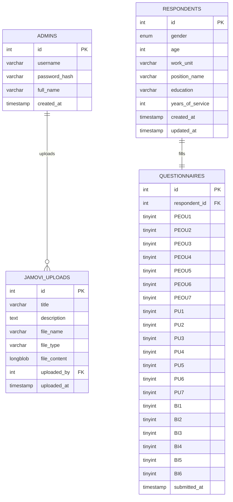

# ERD

```mermaid
erDiagram
    ADMINS ||--o{ JAMOVI_UPLOADS : uploads
    RESPONDENTS ||--|| QUESTIONNAIRES : fills

    ADMINS {
        int id PK
        varchar username
        varchar password_hash
        varchar full_name
        timestamp created_at
    }

    RESPONDENTS {
        int id PK
        enum gender
        int age
        varchar work_unit
        varchar position_name
        varchar education
        int years_of_service
        timestamp created_at
        timestamp updated_at
    }

    QUESTIONNAIRES {
        int id PK
        int respondent_id FK
        tinyint PEOU1
        tinyint PEOU2
        tinyint PEOU3
        tinyint PEOU4
        tinyint PEOU5
        tinyint PEOU6
        tinyint PEOU7
        tinyint PU1
        tinyint PU2
        tinyint PU3
        tinyint PU4
        tinyint PU5
        tinyint PU6
        tinyint PU7
        tinyint BI1
        tinyint BI2
        tinyint BI3
        tinyint BI4
        tinyint BI5
        tinyint BI6
        timestamp submitted_at
    }

    JAMOVI_UPLOADS {
        int id PK
        varchar title
        text description
        varchar file_name
        varchar file_type
        longblob file_content
        int uploaded_by FK
        timestamp uploaded_at
    }
```
