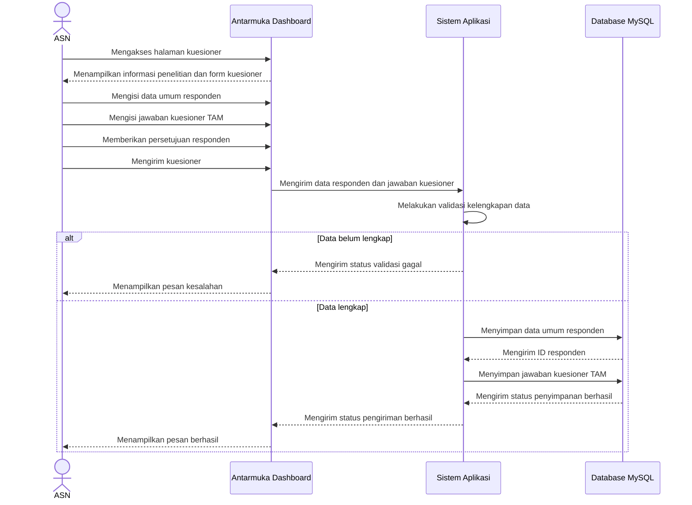
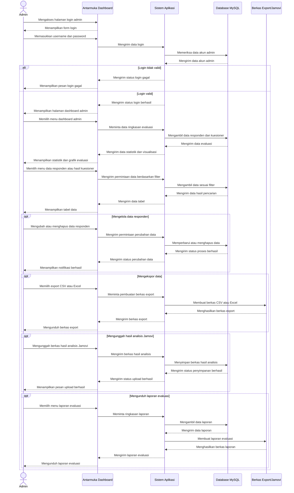

# Sequence Diagram

## Sequence Diagram ASN

Sequence diagram ASN menggambarkan interaksi antara ASN, antarmuka dashboard, sistem aplikasi, dan database MySQL. Setelah ASN mengisi data dan mengirim kuesioner, sistem melakukan validasi. Jika data lengkap, sistem menyimpan data umum responden dan jawaban kuesioner ke database.

## Sequence Diagram Admin

Sequence diagram Admin menggambarkan interaksi antara admin, antarmuka dashboard, sistem aplikasi, database MySQL, dan berkas export atau hasil analisis. Admin dapat melakukan login, melihat visualisasi, mengelola data responden, mengekspor data, mengunggah file hasil analisis Jamovi, dan mengunduh laporan evaluasi.
