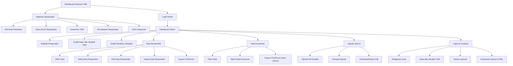

# Struktur Menu

Struktur menu sistem dibagi berdasarkan dua aktor utama, yaitu ASN sebagai responden dan admin sebagai pengelola data. ASN hanya mengakses halaman pengisian kuesioner, sedangkan admin memiliki akses ke halaman dashboard, data responden, hasil kuesioner, upload hasil analisis Jamovi, dan laporan evaluasi.

Halaman responden berisi informasi penelitian, form data umum responden tanpa identitas pribadi, form kuesioner TAM, persetujuan responden, dan tombol kirim kuesioner. Halaman admin digunakan untuk mengelola data hasil pengisian kuesioner, menampilkan visualisasi, mengekspor data untuk Jamovi, mengarsipkan file hasil analisis, dan mengunduh laporan evaluasi.
