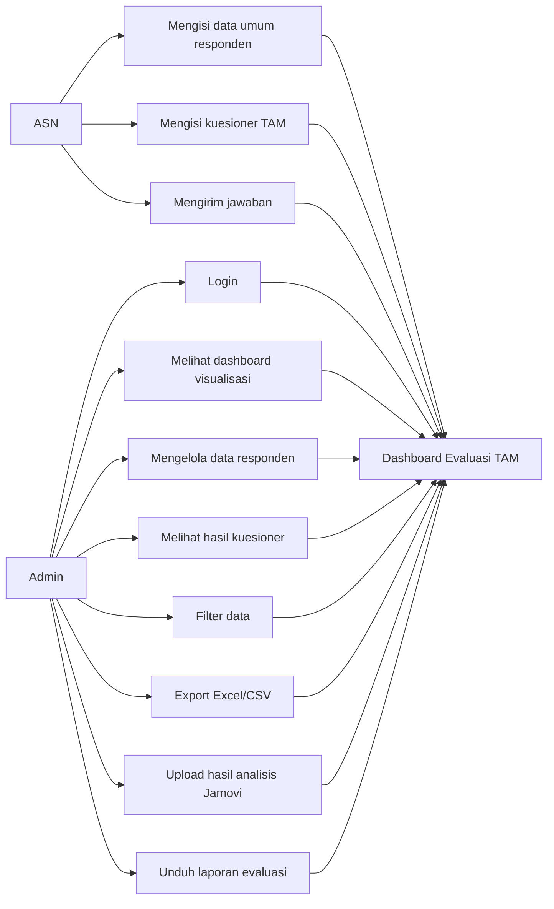

# Use Case

## Skenario Utama ASN

1. ASN membuka aplikasi.
2. ASN mengisi data umum tanpa nama, NIP, email, atau identitas pribadi.
3. ASN mengisi 20 item kuesioner TAM.
4. ASN menekan tombol kirim.
5. Sistem menyimpan data umum responden dan jawaban ke MySQL.

## Skenario Utama Admin

1. Admin login.
2. Admin membuka dashboard.
3. Admin memantau jumlah responden dan grafik hasil.
4. Admin memfilter dan mengecek data.
5. Admin mengekspor data untuk dianalisis di Jamovi.
6. Admin mengunggah hasil analisis Jamovi.
7. Admin mengunduh laporan evaluasi.
